# RepoVerse 🪐

**Turn your GitHub Profile into a living, breathing universe.**

RepoVerse is a cosmic engine that visualizes your code repositories as planets orbiting a central sun (you!). It generates an animated SVG that you can embed directly into your GitHub Profile README.



## Features

*   **Planets**: Each repo is a planet.
*   **Live Stats**: Real-time stars, language, and size.
*   **Auto-Cycling HUD**: Displays details for every repo.
*   **Zero Config**: Works out of the box.

## Usage

1.  **Fork** this repository.
2.  Go to **Actions** and enable workflows.
3.  Run the **Update Universe** workflow manually once.
4.  Add this to your **Profile README**:

```markdown

```

*Replace `YOUR_USERNAME` with your GitHub username.*

## Configuration

The workflow runs automatically every 12 hours.

To increase API limits for large accounts, add a `GITHUB_TOKEN` secret to your repo settings.

## Customization

You can tweak the physics and aesthetics in `src/lib/planet-generator.ts` and `src/lib/svg-generator.ts`.
